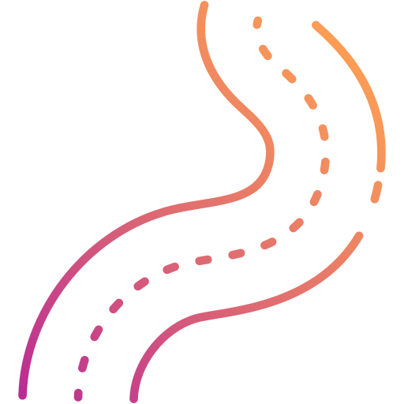

<!-- Improved compatibility of back to top link: See: https://github.com/othneildrew/Best-README-Template/pull/73 -->
<a name="readme-top"></a>


<!-- PROJECT SHIELDS -->
<!--
*** I'm using markdown "reference style" links for readability.
*** Reference links are enclosed in brackets [ ] instead of parentheses ( ).
*** See the bottom of this document for the declaration of the reference variables
*** for contributors-url, forks-url, etc. This is an optional, concise syntax you may use.
*** https://www.markdownguide.org/basic-syntax/#reference-style-links
-->


<!-- PROJECT LOGO -->
<br />
<div align="center">
  <a href="https://github.com/othneildrew/Best-README-Template">
    
  </a>

  <h3 align="center">Road Mapper - Using UNET</h3>

  <p align="center">
    Rede Neural para segmentação de Mapas de Remissão.
    <br />
    <a href="https://colab.research.google.com/drive/1dQOUepYHLWfXA6mPaJcyYEpk9t6SQ3Ps?usp=sharing"><strong>Colab Notebook >></strong></a>
    <br />
    <br />
    <a href="https://drive.google.com/file/d/1aPpq7y0MaAZg8MKYj7dUbOeNFatMJPQa/view">Dataset PNG</a>
    .
    <a href="https://www.kaggle.com/datasets/ludmiladias/road-mapper-6classes">Dataset 6 classes</a>
    .
    <a href="https://www.kaggle.com/datasets/ludmiladias/road-mapper-dataset-csv/data">Dataset  classes</a>
    <br>
    <a href="https://github.com/luddias/road_mapper-study/blob/main/Artigos_e_relatorios/IJCNN_2018_UFES_Raphael_Carneiro_Mapping_road_lanes_using_laser_remission_and_deep_neural_networks-1.pdf">Artigo Base</a>
    
  </p>
</div>


<!-- TABLE OF CONTENTS -->
<details>
  <summary>Sumário</summary>
  <ol>
    <li>
      <a href="#about-the-project">Sobre o Projeto</a>
      <ul>
        <li><a href="#built-with">Tecnologias Utilizadas</a></li>
      </ul>
    </li>
    <li>
      <a href="#getting-started">Primeiros Passos</a>
      <ul>
        <li><a href="#prerequisites">Pré-requisitos</a></li>
        <li><a href="#installation">Instalação</a></li>
      </ul>
    </li>
    <li><a href="#usage">Colocando pra rodar!</a></li>
    <li><a href="#application">Aplicação</a></li>
    <li><a href="#acknowledgments">Referências</a></li>
    <li><a href="#license">License</a></li>
    <li><a href="#contact">Contato</a></li>
  </ol>
</details>


<!-- ABOUT THE PROJECT -->

## Sobre o Projeto

Projeto desenvolvido usando a rede de segmentação U-NET, biblioteca Keras e Tensorflow.
O Road Mapper DNN tem como objetivo gerar mapas de estrada com segmentação das faixas de sinalização utilizada pelos veículos, tendo como entrada mapas de remissão gerados pelo LIDAR - sensor laser que faz parte do sistema de carros autônomos como o ASTRO da Lume Robotics.

<div align="center">
  
  Input | Output
  ------|--------
  |
</div>


<p align="right">(<a href="#readme-top">back to top</a>)</p>

Esse projeto foi feito utilizando como referência o artigo "Mapping Road Lanes using Laser Remission and Deep Neural Networks"[1], entretanto utilizando-se uma rede neural de segmentação semântica diferente e mais atual, U-NET, ao invés da E-NET.
O artigo usado como referência propõe o uso de Redes Neurais Profundas (Deep Neural Networks – DNN) para solucionar o problema de inferir a posição e as propriedades relevantes das faixas de trânsito urbanas com pouca ou nenhuma sinalização horizontal – subsistema da sinalização viária composta de marcas, símbolos e legendas, apostos sobre o pavimento da pista de rolamento – a fim de permitir a operação de carros autônomos nas descritas situações.
Nas vias urbanas, um carro autônomo deve permanecer dentro de uma faixa mantendo um espaço entre outros veículos, para que isso ocorra deve-se conter mapas internos das faixas das estradas. Os seres humanos fazem uso das sinalizações horizontais para se orientar quanto as estradas e existem vários trabalhos sobre como detectar essas marcações para se utilizar em sistemas ADAS, porém se essas marcas estiverem em condições ruins e o sistema depender somente disso, então se tornará impossível para o carro autônomo se locomover nas condições desejadas.

### Descrição das Classes
- Classe 0 (0) ➝ O que não é pista.
- Classe 1 (1,2,3,4) ➝ Limite entre a classe 0 e a pista
- Classe 2 (5,6) ➝ Detalhes de divisão de tipo de pista
- Classe 3 (7,8,9,10) ➝ Área da pista mais próxima da classe 1
- Classe 4 (11,12) ➝ Pista
- Classe 5 (13,14,15,16) ➝ Centro da Pista

### Tecnologias Utilizadas

* [![Python.logo][Python]][py-url]
* [![Keras.logo][Keras]][keras-url]
* [![Tensorflow.logo][tf]][tf-url]
* [![numpy.logo][Numpy]][np-url]
* [![pandas.logo][Pandas]][pd-url]
  


<p align="right">(<a href="#readme-top">back to top</a>)</p>


<!-- GETTING STARTED -->
## Colocando pra rodar!

### Pré-Requisitos
Siga um dos tutoriais abaixo para instalar a biblioteca Python caso esteja executando diretamente no seu dispositivo ao invés de um serviço em nuvem (colab, ).

Obs.: Talvez seja necessário a instalação de outros pacotes além desse e dos que estão disponíveis no jupyter notebook do projeto.

 * ![baixarPython][windowsPy]
 * ![baixarMac][macPy]
 * ![baixarLinux][linuxPy]

Foi-se utilizado nesse projeto as máquinas virtuais gratuitas disponibilizadas no ambiente de desenvolvimento do [Kaggle](https://www.kaggle.com/) e Google Colab.

### Execução

O projeto é dividido em duas partes: Geração de dados, Treinamento e Avaliação da Rede. As duas etapas se encontram no notebook mas deve-se realizar uma pausa após a primeira etapa para reiniciar o kernel e liberar a memória para a próxima etapa.
### Pré Processamento de Dados

O processo do tratamento de dados é feito nas seguintes etapas:
- Importar os dados das imagens para uma matriz (array)
- Realizar o Label Encoder com o array do ground truth (Y)
- Dividir os dados em array de treino e teste
- Gerar Pesos das classes com base nos dados
- Salvar Arrays em CSV


Com o objetivo de treinar uma grande quantidade de dados mesmo com hardware limitado, é se utilizado no treinamento o "batch_generator" uma função que acessa o arquivo CSV e resgata para uso apenas uma parte do tamanho do batch para o step. No próximo step, um novo batch é recuperado e os dados do batch anterior são descartados.

Sendo assim, após tratar e normalizar os dados do dataset eles devem ser salvos em um arquivo CSV. As etapas que não devem ser executadas antes do arquivo ser salvo no CSV é o *"to_categorical"*, que irá tranformar as classes em valores binários, e o *"normalize"*, para não ocorrer vazamento de dados. Essa etapa será executada dentro do batch generator, pois além dele demandar muito tempo para executar quando há uma grande quantidade de dados, também torna o arquivo final muito grande o que atrapalha o processamento das proximas etapas de conversão do array para um arquivo CSV.

Como todos os processos estão sendo realizados visando que ele consiga ser executado nos limites de hardware que o Kaggle fornece, a etapa de salvamento dos arrays de teste e treino no CSV é executada salvando esse array em partes. Como pode visualizar a baixo, é passado como parâmetro para a função *"salvar_csv"* pedaços do *array* que são convertidos em listas e em dataframes e depois adicionados ao final do arquivo CSV por meio do modo "a" que a função *"to_csv"* possui, que se refere ao *"append"* do python.

```python

import csv
import pandas as pd

def salvar_csv(X, Y):
    # Criar um DataFrame com os arrays
    data = {'X_input': X.tolist(), 'Y_output': Y.tolist()}
    df = pd.DataFrame(data)
    df.to_csv('test_data.csv', index=False, mode="a")
```

```python
for i in range(0,8):
    salvar_csv(X_train[(i*5000):((i+1)*5000)], y_train[(i*5000):((i+1)*5000)])
```

Logo que a etapa anterior for concluída e os arquivos CSVs forem obtidos, poderá se iniciar a etapa de compilação da rede. A seguir, deve-se executar a função batch_generator e definir alguns valores para o treinamento, como os valores gerados pelo batch_generator, o tamanho dos batchs, a quantidade de dados por step, entre outros dados que estão presentes no notebook para a definição.
```python
# Batch Generator
from tensorflow.keras.utils import to_categorical
import json
from keras.utils import normalize

import pandas as pd

def batch_generator(Train_df,batch_size,
                    steps, skiprows):
    idx=1
    while True:
        yield load_data(Train_df,idx-1,batch_size, skiprows[idx-1])## Yields data
        if idx<steps:
            idx+=1
        else:
            idx=1
        avoid_inactivity()

def load_data(Train_df,idx,
              batch_size, sr):
    n_classes = 

    df = pd.read_csv(
                  Train_df, skiprows=sr,
                  nrows=batch_size)

    x = []
    y = []

    for i in range(0, batch_size):
        x.append(json.loads(df.iloc[i,0]))
        y.append(json.loads(df.iloc[i,1]))

    y = np.asarray(y)
    x = np.asarray(x)

    train_masks_cat = to_categorical(y, num_classes=n_classes)
    y = train_masks_cat.reshape((y.shape[0], y.shape[1], y.shape[2], n_classes))
    x = normalize(x, axis=1)


    return (x, y)
```

### Treinamento e Avaliação de desempenho
Após isso, o treinamento já pode ser iniciado. Lembre-se que recomenda-se realizar incialmente testes com menos epochs e steps testando os parâmetros de entrada da rede, com o objetivo de ajusta-los para um melhor treinamento. Então, deve ser iniciado o treinamento. Ao fim dessa etapa, deve-se gerar os gráficos de acurácia para visualização dos resultados obtidos com o treino. Além disso, por fim, deve-se também executar o predict para se testar a rede treinada e verificar os resultados de desempenho com novos dados, afim de verificar sua acurácia


O tempo para a execução dessa parte do projeto depende dos resultados obtidos durante. Na imagem abaixo é possível visualizar melhor as etapas que deveremos seguir nessa parte do projeto. Esse ciclo deve ser repetido até se obter os resultados desejados com a rede. Entre essas etapas, principalmente na parte de ajuste de parâmetros, pode-se fazer necessário implementar novas métricas ou abordagens a rede, dependendo dos resultados.

<br />
<div align="center">
  <a href="https://github.com/luddias/RoadMapper-UNET/blob/main/src/Estrat%C3%A9gia%20e%20planejamento%20-%20Page%201.jpeg?raw=true">
    
</a>
</div>

As métricas utilizadas para avaliação de desempenho do modelo foram:
- Acurácia
- F1 Score
- Precisão
- Recall
- Matriz de Convolução
- IoU Score

<p align="right">(<a href="#readme-top">back to top</a>)</p>

<!-- USAGE EXAMPLES -->
## Resultados
<br>

- *Gráfico das métricas de avaliação*


<br>

- *Tabela dos resultados finais*

Train Accuracy |	Val Accuracy |	Test Accuracy |	Test F1 |	Test MeanIoU |	Test Prec |	Test Recall
-------|---------|---------|---------|---------|---------|--------
0.9483 |	0.9418 |	0.9313 |	0.8280 |	0.7234 |	0.8310 |	0.8261


<br>

- *Matriz de Confusão*
  


<br>

- *Exemplo de imagem de saída do modelo*
  


<br>
<p align="right">(<a href="#readme-top">back to top</a>)</p>


<!-- ACKNOWLEDGMENTS -->
## Referências

[1] CARNEIRO, Raphael Vivacqua; GUIDOLINI, Ranik; CARDOSO, Vinicius Brito; NASCIMENTO, Rafael C. Mapping Road Lanes using Laser Remission and Deep Neural Networks. IEEE, [S. l.], p. 1-8, 27 abr. 2018.

[2] AHMAD, P. et al. MH UNet: A Multi-Scale Hierarchical Based Architecture for Medical Image Segmentation. IEEE Access, v. 9, p. 148384–148408, 2021.

‌[3] Ronneberger, O., Fischer, P., & Brox, T. (2015). U-net: Convolutional networks for biomedical image segmentation. In International Conference on Medical image computing and computer-assisted intervention (pp. 234-241). Springer, Cham.

<p align="right">(<a href="#readme-top">back to top</a>)</p>


<!-- CONTACT -->
## Contato

![adress][email-url]


<p align="right">(<a href="#readme-top">back to top</a>)</p>


<!-- MARKDOWN LINKS & IMAGES -->
<!-- https://www.markdownguide.org/basic-syntax/#reference-style-links -->
[contributors-shield]: https://img.shields.io/github/contributors/othneildrew/Best-README-Template.svg?style=for-the-badge
[contributors-url]: https://github.com/othneildrew/Best-README-Template/graphs/contributors
[forks-shield]: https://img.shields.io/github/forks/othneildrew/Best-README-Template.svg?style=for-the-badge
[forks-url]: https://github.com/othneildrew/Best-README-Template/network/members
[stars-shield]: https://img.shields.io/github/stars/othneildrew/Best-README-Template.svg?style=for-the-badge
[stars-url]: https://github.com/othneildrew/Best-README-Template/stargazers
[issues-shield]: https://img.shields.io/github/issues/othneildrew/Best-README-Template.svg?style=for-the-badge
[issues-url]: https://github.com/othneildrew/Best-README-Template/issues
[license-shield]: https://img.shields.io/github/license/othneildrew/Best-README-Template.svg?style=for-the-badge
[license-url]: https://github.com/othneildrew/Best-README-Template/blob/master/LICENSE.txt
[linkedin-shield]: https://img.shields.io/badge/-LinkedIn-black.svg?style=for-the-badge&logo=linkedin&colorB=555
[linkedin-url]: https://linkedin.com/in/othneildrew
[product-screenshot]: images/screenshot.png
[keras]: https://img.shields.io/badge/Keras-D00000?style=for-the-badge&logo=keras&logoColor=white
[keras-url]: https://keras.io/
[tf]: https://img.shields.io/badge/Tensorflow-FF6F00?style=for-the-badge&logo=tensorflow&logoColor=white
[tf-url]: https://www.tensorflow.org/?hl=pt-br
[python]: https://img.shields.io/badge/Python-3776AB?style=for-the-badge&logo=python&logoColor=white
[py-url]: https://www.python.org/
[Numpy]: https://img.shields.io/badge/NumPy-013243?style=for-the-badge&logo=numpy&logoColor=white
[np-url]: https://numpy.org/
[windowsPy]: https://img.shields.io/badge/Instalar%20Python%20no%20Windows-0078D6?style=for-the-badge&logo=windows10&logoColor=white&link=https%3A%2F%2Fpython.org.br%2Finstalacao-windows%2F
[macPy]: https://img.shields.io/badge/Instalar%20Python%20no%20Mac%20OS-000000?style=for-the-badge&logo=apple&logoColor=white&link=https%3A%2F%2Fpython.org.br%2Finstalacao-mac%2F
[linuxPy]: https://img.shields.io/badge/Instalar%20Python%20no%20LInux-F09D13?style=for-the-badge&logo=linux&logoColor=white&link=https%3A%2F%2Fpython.org.br%2Finstalacao-linux%2F
[email-url]: https://img.shields.io/badge/ludmiladias.dev%40gmail.com-EA4335?style=for-the-badge&logo=gmail&logoColor=white
[pd-url]: https://pandas.pydata.org/
[pandas]: https://img.shields.io/badge/PANDAS-%23150458?style=for-the-badge&logo=pandas&logoColor=white


